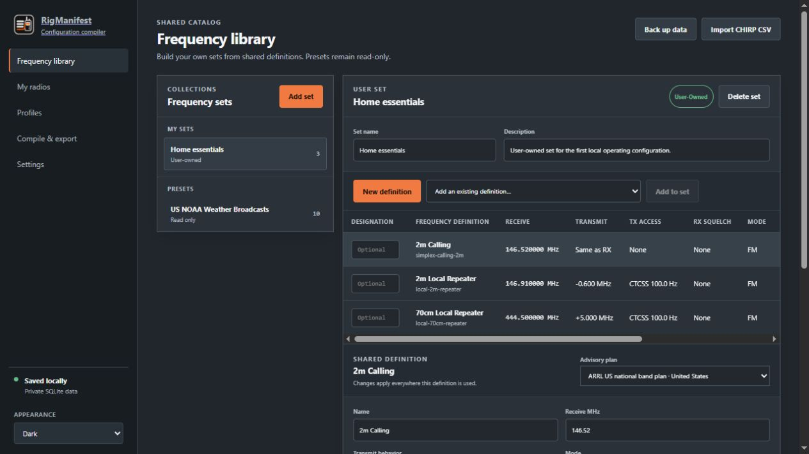
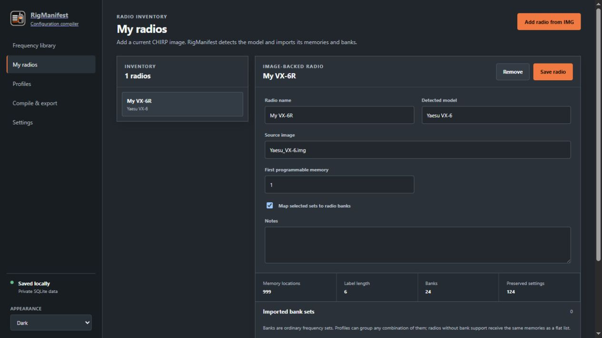
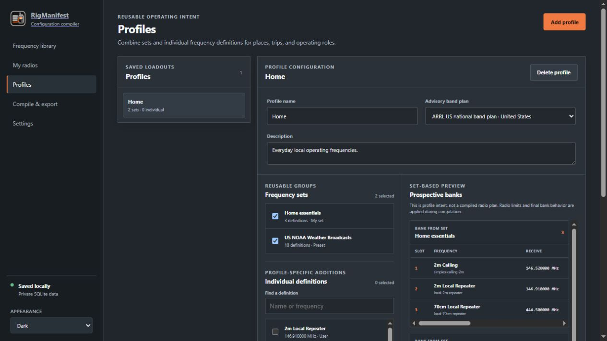
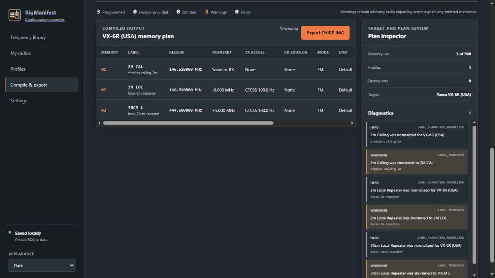

# User Guide

RigManifest has five primary pages. The workflow normally moves from reusable catalog
data, through radio and profile organization, to compilation and export.

## Frequency Library

The Frequency Library is the shared source of truth for reusable RF intent.

### Frequency sets

The left column lists user-owned sets and read-only presets. Select a set to edit its
name, description, order, and membership. **Add set** creates an empty user-owned set;
you can then create a definition or add an existing shared definition.

Presets such as NOAA, FRS, GMRS, MURS, Citizens Band, and regulated 60-meter entries
use the same underlying set and definition model but remain read-only. A user set may
reference preset definitions without copying them.

### Frequency definitions

Select anywhere on a table row to edit that definition. A definition may contain:

- receive frequency;
- transmit behavior: same, offset, split, or disabled;
- transmit access and receive squelch, independently using CTCSS or DCS;
- mode and tuning step;
- label, priority, and notes; and
- optional provenance or a channel designator when the underlying service is
  genuinely channelized.

The catalog accepts any positive frequency. Compatibility with an HT, mobile, or
other target is evaluated only during compilation.

### Import and backup

**Import CHIRP CSV** is available for generic interchange. CSV cannot preserve banks
or general radio settings, so IMG is preferred for adding and exporting a radio.

**Back up data** creates a consistent workspace backup, including managed radio images.

## My Radios

Each radio starts from a CHIRP image. RigManifest detects the driver, imports its
memories and banks, and records model capabilities from that exact image-bound driver.

The page shows every managed source and compiled image version for the selected radio.
The files live under `radios/<radio-id>/` in the workspace; SQLite stores metadata,
hashes, and relative paths rather than binary blobs.

The first programmable memory controls where a compiled sequence begins. When bank
mapping is enabled, selected sets are mapped through the CHIRP bank model. Radios
without bank support receive the same compatible memories as a flat list.

Removing a radio removes its inventory record from the active workspace. Keep your
original CHIRP source image and normal workspace backups.

## Profiles

Profiles describe reusable operating intent for places, trips, events, or roles. A
profile can select any number of frequency sets plus individual definitions that do
not belong in a reusable set.

The prospective-bank preview groups definitions according to their sets. It helps
explain the intended organization but does not promise a specific radio layout. Bank
count, bank support, capacity, duplicate selections, and other target details are
resolved during compilation.

Profiles may save an advisory band plan. Plan warnings help identify unusual choices
but never block a compile.

## Compile & Export

A compile selection consists of one radio plus any combination of profiles, extra
sets, and extra individual definitions. Duplicate references resolve to one canonical
definition while retaining provenance from every selected source.

The compiled table shows memory number, label, receive and transmit behavior,
transmit access, receive squelch, mode, and tuning step. The inspector summarizes
capacity and diagnostics.

Typical diagnostics include:

- label normalization or truncation;
- unsupported frequency, mode, step, or signaling;
- transmit restrictions;
- capacity omissions; and
- bank/grouping degradation.

Warnings explain a result and remain non-blocking. Errors or radio-capability failures
can omit a memory when representing it would be unsafe or invalid. RigManifest does
not silently turn receive-only intent into a transmittable memory.

Export creates a new managed image version and copies it to your chosen destination.
Inspect that image in CHIRP, then use CHIRP to write it to the radio.

## Settings

Settings includes:

- Dark, Light, and System appearance modes;
- global font scaling for high-resolution or distant displays;
- automatic update-check preferences; and
- manual update checks and release access.

Installed Windows, macOS, and AppImage builds support user-approved in-app updates.
Portable Windows and Debian builds report new versions and direct you to the release
download.

## Workspace locations

Installed builds use the platform's normal per-user application-data directory.
Windows portable and Linux AppImage builds use a `data` directory beside the app.
That directory contains the SQLite workspace, managed images, and backups.

For portable use, move or copy the application and its adjacent `data` directory
together.
